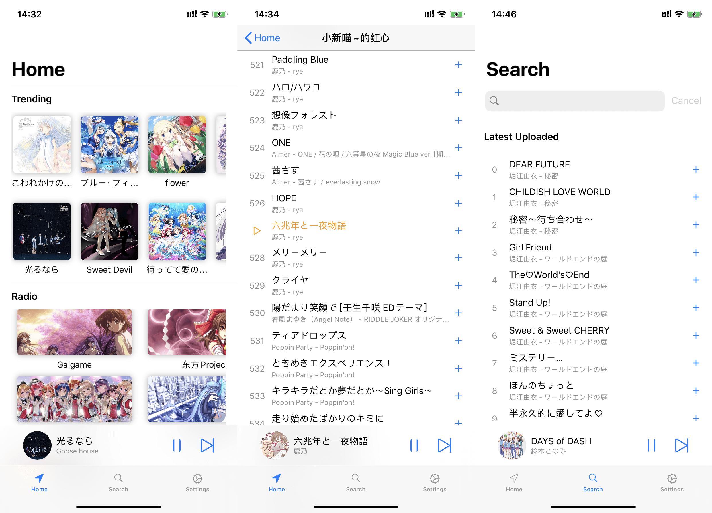

<p align="center">
  
</p>

<h1 align="center">Biu</h1>

<p align="center">Just a Music App written with SwiftUI</p>

## Build 

Just clone the repo and compile.

### API

Biu uses the Biu.Moe Music API to play music and manage playlists. Due to the limitation of Biu.Moe, this repo does not include the API credential file `Biu.plist`. You may need to contact @XinNya or @Mikubill to get `Biu.plist` to build the application on your own.

### Dependencies

Biu uses carthage to manage dependencies. You can update dependencies by:

```
carthage update --platform iOS
```

## Contribution

Feel free to contribute.

因为作者太菜，很多bug的QwQ。欢迎各位大佬pr

